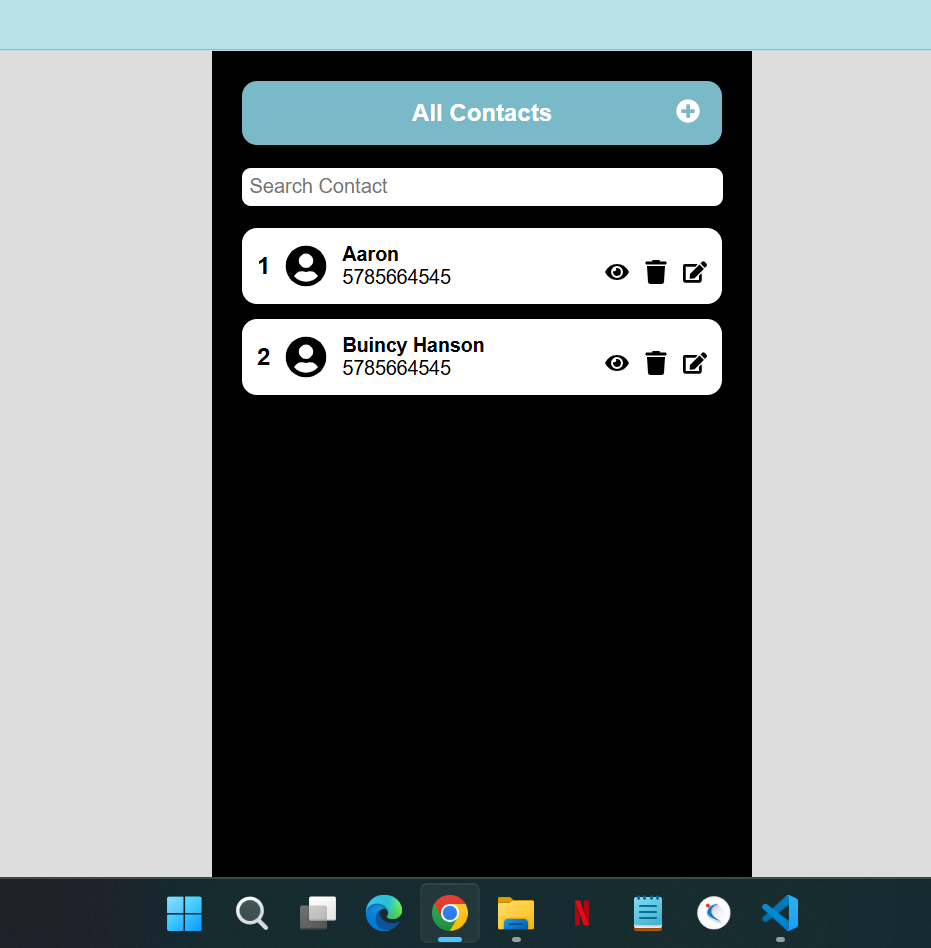
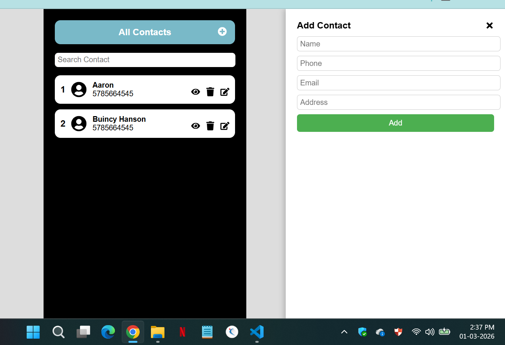
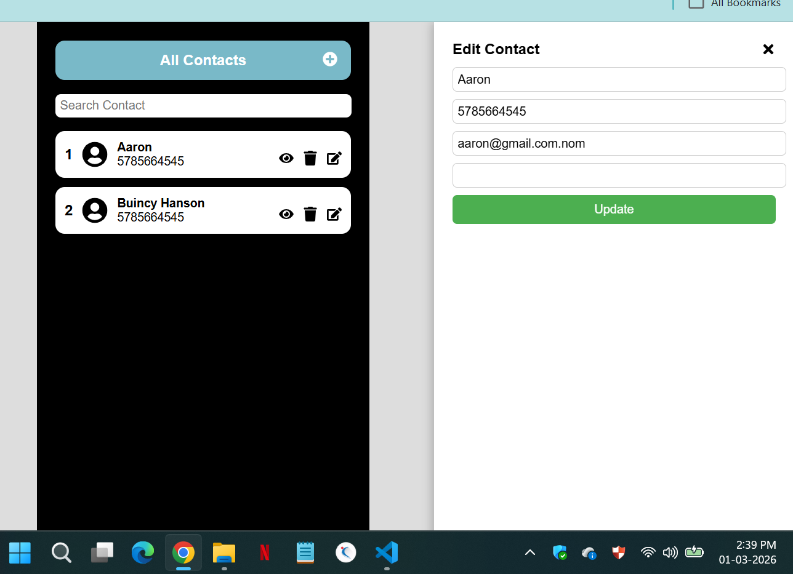
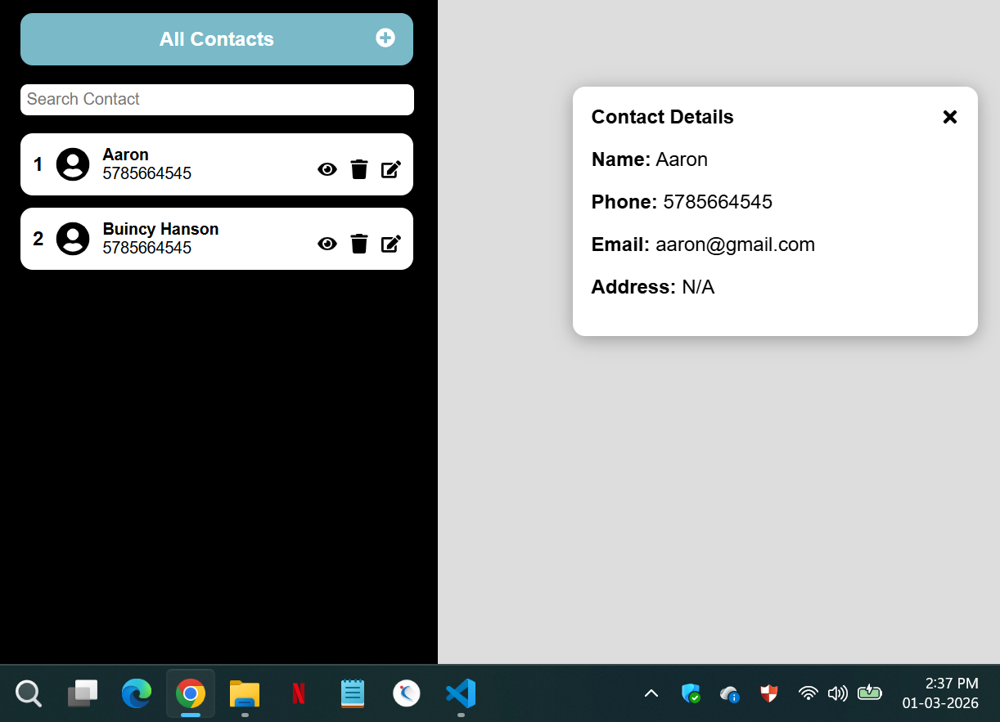
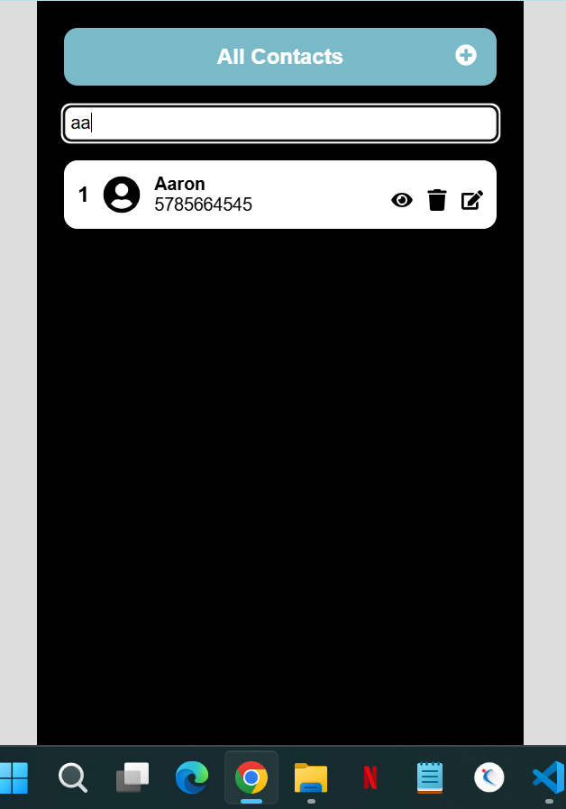

Contact Management App

This is a simple React Contact Management Application built as part of a coding task.
The app fetches contact data from an external GitHub JSON URL and allows basic CRUD operations on the frontend.

🚀 Features
Fetch contacts from external API (GitHub raw JSON)
Display contacts in mobile-style UI
Search contacts by name
Add new contact
Edit existing contact
Delete contact
Responsive mobile container design

## Homepage Screenshot

## AddContact Screenshot

## EditContact Screenshot

## ViewContact Screenshot

## SearchContact Screenshot

